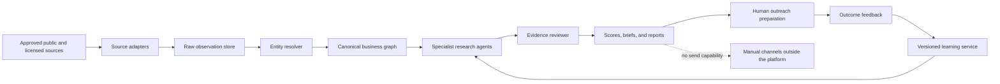

# Que Media Intelligence Architecture

Date: 2026-07-20

## Current delivery

This repository contains the product interface, domain contracts, integration boundaries, evidence-aware scoring views, client report rendering, read-only JSON endpoints, and a dated 20-business Ottawa research cohort. Runtime profiles are deterministically assembled from the structured files in `research/` and `research/verified-leads-audit.json`; no demo or fallback prospect records are seeded.

The current cohort is point-in-time research, not a live integration. Empty states remain for recurring agents, connectors, and source operations until approved credentials, durable storage, and separately deployed workers exist. The architecture below defines those boundaries so live activation does not compromise evidence quality, source terms, privacy, or the permanent ban on automatic outreach. Missing integrations and unmeasured observations remain explicitly unavailable.

## System context

The application is intentionally absent from the final communication path. It may prepare, edit, and copy a draft. It cannot hold sending credentials, schedule sequences, post to social accounts, or contact a business.

## Source adapter layer

Every production source must be implemented as a named adapter with the following contract:

- collection purpose and lawful access method;
- allowed fields and retention period;
- geographic and industry scope;
- refresh schedule, rate limit, and retry policy;
- source terms and robots policy record where applicable;
- last success, last failure, and structural-change health;
- a typed result containing the raw observation, capture time, public URL or licensed record identifier, and access level.

Official APIs and licensed data are preferred. HTTP extraction is used only where appropriate. Browser execution is reserved for JavaScript-dependent public pages and must use explicit throttling, deduplication, and source-specific rules.

Missing access is represented as `unavailable`, never as a zero metric. Owner-authorized social analytics remain separate from public competitor observations.

## Evidence and entity graph

The canonical store separates five layers:

1. Raw observations preserve the source response or captured page fragment.
2. Facts normalize values such as domain, address, category, hours, account handle, and leadership role.
3. Claims interpret one or more facts and carry confidence, freshness, and contradiction state.
4. Recommendations connect approved claims to Que Media capabilities and a measurable outcome hypothesis.
5. Draft assets reference only approved claims and never create new facts.

Entity resolution uses normalized names, domains, phone numbers, addresses, place identifiers, and social handles. A merge creates a reversible alias relationship and retains every source record. Conflicting values remain visible until a deterministic freshness rule or a human review resolves them.

Suggested durable tables include `businesses`, `business_aliases`, `locations`, `people`, `accounts`, `source_records`, `observations`, `facts`, `claims`, `contradictions`, `agent_runs`, `score_versions`, `reports`, `drafts`, `timeline_events`, and `outcomes`.

## Modular agent orchestration

The orchestrator owns schedules, checkpoints, retries, budgets, and review gates. Agents own one narrow responsibility and exchange typed identifiers rather than free-form research transcripts.

The core stages are:

1. Discover candidates from approved Ottawa sources.
2. Resolve duplicates and canonical identity.
3. Enrich the company, public leadership context, locations, and growth signals.
4. Audit website, accessibility, technical SEO, local visibility, social content, and brand consistency.
5. Select and compare relevant local competitors.
6. Score fit, opportunity, timing, reachability, confidence, and effort.
7. Develop Que Media-specific recommendations, content concepts, and objections.
8. Review evidence, contradictions, privacy risk, and generic language.
9. Compose the client report and manual outreach assets.
10. Publish the package to the human review queue.

Each run records the agent version, prompt or rubric version, input evidence identifiers, output schema version, model identifier, cost, latency, confidence, and review result. An evaluator may reject an output, but it cannot silently rewrite the underlying observation.

LangGraph is the recommended inner research graph for checkpointed agent state and human interrupts. Temporal can own multi-day schedules and worker recovery once monitoring volume justifies it. PostgreSQL remains the system of record, with object storage for raw captures and Redis used only for queues or short-lived coordination.

## Review gates

A business package advances only when these persisted gates pass:

- identity confidence is above the configured threshold;
- consequential claims have at least one accessible source record;
- strong recommendations cite the observations that motivated them;
- contradictions are resolved or explicitly disclosed;
- stale high-impact facts are refreshed or marked stale;
- decision-maker context passes professional relevance and intrusion checks;
- outreach copy contains no unsupported facts or generic praise;
- a human marks the package reviewed before copying it for use.

No prompt instruction is treated as a security control. The no-send rule is enforced through absent credentials, absent provider clients, read-only research APIs, and a separate human workflow.

## Explainable scoring

The platform keeps separate scores for Que Media Content Fit, Business Opportunity, Why Now, Reachability, Evidence Confidence, and Response Likelihood.

The prioritization target is expected return on effort:

`priority = fit × opportunity × timing × reachability × confidence ÷ estimated effort`

Every score stores weighted factors, positive and negative contributions, evidence identifiers, missing-data penalties, rubric version, and a plain-language explanation. A score is a navigation aid into the evidence, not a declaration of truth.

The Content Fit rubric emphasizes filmable products or transformations, useful educational depth, credible on-camera participation, repeatable customer stories, entertaining formats, Ottawa community relevance, and a plausible path from content to customer acquisition.

## Why Now and freshness

Signals are immutable events with a source, observed time, event time, confidence, expiry window, and outreach relevance. Examples include openings, expansions, hiring, new services, review milestones, seasonal campaigns, local events, and visible competitor moves.

Volatile facts receive short refresh windows. Stable identity facts refresh less often. Reports freeze their evidence and rubric versions so later updates do not alter a previously reviewed document. New observations create a new report revision and timeline event.

### Recent-signal research adapter

The locally installed [`last30days` skill](https://github.com/mvanhorn/last30days-skill) is the planned research capability for 30-day discovery, hiring signals, competitor pulse, public social and community context, and point-in-time freshness verification. Its output must enter through a dedicated worker adapter after identity resolution, then pass through source-status normalization, cross-source deduplication, story clustering, evidence review, and the canonical business graph.

The local Codex skill is installed and produced one raw, cited Ottawa freshness artifact during the 2026-07-20 assisted research pass. That artifact informed candidate and timing research only after first-party corroboration. The application still has no configured runtime connector, worker, credentials, or schedule. The full adapter contract, source failure semantics, consent boundary, and activation gates are defined in [LAST30DAYS_INTEGRATION.md](LAST30DAYS_INTEGRATION.md).

## API boundaries

The current application exposes only read operations:

- `GET /api/leads`
- `GET /api/leads/:id`
- `GET /api/agents`

The current lead collections return the verified research snapshot and unknown lead identifiers return a not-found response. Operational agent and connector state remains empty because no recurring worker is configured. The API does not synthesize records to make a dashboard appear populated.

A production API may add authenticated research commands such as `POST /research-runs` and `POST /reports/:id/revisions`. These commands enqueue internal work and never contact prospects. There is no `/send`, `/campaign`, `/sequence`, mailbox, or social publishing endpoint.

All write commands require an authenticated Que Media user, workspace authorization, idempotency key, audit event, and explicit resource scope.

## Continuous learning

Replies, objections, meetings, wins, losses, and explicit feedback become versioned outcome records. The learning service evaluates feature usefulness and proposes weight changes. It does not train directly on private message content by default and cannot overwrite historical scores.

Any model or rubric update is tested against a fixed evaluation set for ranking quality, calibration, unsupported-claim rate, personalization quality, privacy risk, and false urgency. A human approves promotion to the active version.

## Failure behavior

- Adapter failure keeps the last successful observation and marks freshness visibly.
- A changed page structure pauses that adapter for review instead of returning empty values.
- Conflicting facts reduce confidence and enter the contradiction queue.
- A model schema failure retries with the same immutable input, then escalates to review.
- A weak or invasive personalization result is blocked from the outreach studio.
- Report rendering failure preserves the approved report model and allows a safe retry.
- Queue or worker outages do not affect the read-only product or previously reviewed packages.

## Deployment topology

- Next.js web application for the authenticated product, report renderer, and read API.
- PostgreSQL for canonical entities, evidence, runs, scores, timelines, and outcomes.
- Object storage for permitted raw captures and generated report artifacts.
- Worker pools separated by collection, deterministic audits, model analysis, and report rendering.
- Queue and scheduler for retries, rate limits, and recurring monitoring.
- Central secrets manager with source-specific credentials unavailable to report and outreach code.
- Observability for adapter health, freshness service levels, agent errors, evidence rejection rates, and audit logs.

Live activation should begin with Google Places, approved directories, local news and event feeds, first-party website audits, and public website social links. Broader licensed enrichment and owner-authorized analytics can follow after source governance and evaluation quality are proven.
