# last30days Freshness Research Integration

Date: 2026-07-20

## Current status

The [`last30days` skill](https://github.com/mvanhorn/last30days-skill) is installed locally for Codex at `/home/ayub/.codex/skills/last30days`. It is available to a Codex session that loads the installed skill and follows its canonical `SKILL.md` workflow.

The Que Media application does not currently have a `last30days` runtime connector, scheduled worker, source credentials, or recurring persisted runs. The local Codex installation is not an application dependency and does not make the dashboard a live monitor.

A one-time assisted run was completed on 2026-07-20 for "Ottawa independent business growth and timely marketing opportunities." The raw artifact is retained at `research/last30days/ottawa-independent-business-growth-and-timely-marketing-opportunities-raw.md`. Reddit, Hacker News, GitHub, and general web paths returned results or status; X, TikTok, Instagram, and YouTube were unavailable in that run. The final lead records therefore rely on direct first-party and cited public sources for company, contact, social, and Why Now claims. The UI may show those verified records, but it must not describe them as continuously monitored.

## Intended role

`last30days` is a freshness research capability, not the canonical company database. It should help the platform find and validate public signals from the latest 30-day window when recency can change the value of outreach preparation.

Appropriate uses include:

- discovering active Ottawa businesses through openings, expansions, launches, local events, hiring, and other recent growth signals;
- refreshing a qualified company's Why Now evidence before a human prepares outreach;
- examining public hiring activity for evidence of strategic priorities;
- comparing recent public discussion and activity around a company and its local competitors;
- understanding current social, creator, and community conversation relevant to a business or industry;
- checking whether a volatile claim is still current before it appears in a report or message draft.

It should not replace first-party company research, licensed business data, deterministic website audits, owner-authorized analytics, or source-specific adapters. It must never send outreach, publish content, interact with posts, or make an unsupported business claim.

## Position in the research pipeline

```mermaid
flowchart LR
  A[Discovery topic or profile refresh request] --> B[Resolve company identity]
  B --> C[Select approved recent-signal sources]
  C --> D[last30days worker adapter]
  D --> E[Source-status manifest]
  D --> F[Raw cited evidence]
  E --> G[Freshness normalizer]
  F --> G
  G --> H[Cross-source deduplication and story clustering]
  H --> I[Claim and signal candidates]
  I --> J[Evidence and privacy review]
  J --> K[Canonical business graph]
  K --> L[Why Now, competitors, reports, and draft preparation]
  L -. manual use only .-> M[Que Media team member]
```



The adapter produces evidence candidates. It does not write final claims, scores, or drafts directly. The existing entity resolver, evidence reviewer, privacy rules, and human approval gates remain authoritative.

## Invocation contract

A production freshness worker should accept a typed request such as:

```ts
type FreshnessResearchRequest = {
  researchRunId: string;
  purpose:
    | "lead_discovery"
    | "profile_refresh"
    | "why_now"
    | "hiring_signals"
    | "competitor_pulse"
    | "social_community_pulse";
  topic: string;
  windowDays: 30;
  geography?: {
    city: "Ottawa";
    region: "Ontario";
    country: "Canada";
  };
  entity?: {
    businessId?: string;
    canonicalName: string;
    domain?: string;
    publicHandles?: Record<string, string>;
  };
  competitorEntities?: Array<{
    businessId?: string;
    canonicalName: string;
    domain?: string;
    publicHandles?: Record<string, string>;
  }>;
  approvedSources: string[];
  requireFreshnessVerification: boolean;
};
```

The worker must invoke the installed engine through the workflow defined by its canonical `SKILL.md`, including its preflight, entity planning, source handling, and JSON output contract. The application adapter must not recreate a reduced web-search imitation and label it as a `last30days` result.

A normalized result should contain:

- the immutable research run identifier, request purpose, query window, start time, completion time, and engine contract version;
- resolved entity identifiers, domains, locations, platform handles, first-party positioning, and unresolved collisions;
- one status per requested source, using states such as `available`, `unavailable`, `failed`, `skipped`, or `consent_required`;
- raw artifact references and individual evidence items with source, public URL, publication time, observation time, publisher or public account, excerpt or extracted fact, and source-provided engagement metrics when available;
- deduplicated story clusters with contributing evidence identifiers and independent-source coverage;
- candidate signals and claims with freshness, confidence, supporting evidence, contradictions, and expiry;
- explicit gaps, ambiguous matches, failed lookups, and a valid `nothing_solid` outcome when the evidence floor is not met.

The adapter must reject malformed output. It must not create placeholder sources, counts, dates, engagement, quotations, or conclusions to satisfy a schema.

## Entity resolution before research

Recent-signal research is useful only when results refer to the intended business. Before invocation, the resolver should establish as many of the following as public evidence permits:

- canonical company name and known aliases;
- Ottawa location, address, service area, or another geographic anchor;
- official domain and current first-party positioning;
- public social handles and platform account URLs;
- distinctive owners, founders, products, or categories needed for disambiguation;
- competitor identities resolved independently rather than inferred from similar names.

Every query plan should carry those anchors. Common or collision-prone business names require the domain, location, industry, or another specific identifier in each search query. Results that match a different entity remain rejected evidence, not a secondary business profile.

## Lead discovery and Why Now policy

For lead discovery, the research topic should combine Ottawa with one evidence-seeking business condition, such as an opening, expansion, local event, new service, or relevant hiring signal. A broad popularity query is not enough to qualify a lead.

A discovered mention creates a candidate only when the system can resolve it to a real business with at least one accessible professional or first-party source. The normal qualification pipeline must still assess Que Media Content Fit, business opportunity, reachability, evidence confidence, and expected return on effort.

For Why Now, the adapter should preserve both the event date and the date it was observed. Each signal needs a type-specific expiry window. Before a human uses a time-sensitive claim, the freshness verifier should point-refetch supported evidence or mark the claim stale or unavailable. A missing or failed verification blocks the claim from outreach copy.

## Hiring signals

Hiring research can identify recent emphasis on marketing, content, growth, photography, video, community, sales, locations, or new services. It is an input to strategy, not proof of purchasing intent.

The worker should use the skill's hiring-focused workflow and preserve the original job or careers URL, publication date when available, role, location, and employer identity. It should distinguish an official careers posting from a repost or aggregator. For larger organizations, broad hiring volume must receive a noise penalty because unrelated roles can obscure the local business signal.

## Competitor and community pulse

Competitor runs require separately resolved identities and should compare the same recent window. The product should surface differences in current activity, topics, community response, content formats, and momentum only when comparable public evidence exists. Missing evidence for one company must remain missing rather than become a zero value.

Social and community findings are `public_observed` evidence. They are not owner-authorized reach, retention, audience, conversion, or demographic analytics. Public engagement can help rank evidence inside a source, but it cannot prove business impact or customer sentiment by itself.

## Cross-source deduplication and clustering

The same announcement may appear on an official site, a local publication, Reddit, X, YouTube, and several reposts. The platform should cluster by normalized entity, event, URL canonicalization, text similarity, publication time, and referenced first-party artifact.

Each cluster should retain every evidence item while designating the most direct source. Independent sources increase confidence. Syndicated articles, copied captions, quote-posts, and reposts do not count as independent confirmation. Engagement is a ranking input only when the source actually provides it, and it must never be estimated to fill a gap.

A cluster becomes a claim candidate only when its evidence supports the specific wording of the claim. Single-source findings can remain usable when the source is first party and the claim is narrow, but the lower independence must be visible.

## Citations and provenance

Every imported evidence item must be traceable to an accessible public URL or an approved licensed-record identifier. The normalized record should retain:

- source platform and adapter version;
- canonical URL and original URL when redirects matter;
- publisher, channel, or public account;
- published time, observed time, and requested research window;
- the minimal excerpt or extracted field that supports the claim;
- capture artifact checksum or object-store reference where retention is permitted;
- source access class, collection purpose, and retention policy;
- links to derived clusters, claims, recommendations, report sections, and drafts.

The client report should cite the supporting public source near each consequential claim. If a URL is no longer accessible, the claim should show its archived observation and current availability state rather than silently appearing verified.

## Source-status and empty-result behavior

The source-status manifest is required even when no evidence is returned. These states have different meanings:

- `available`: the source was queried successfully, including a valid zero-result response;
- `unavailable`: the approved capability or provider is not present;
- `failed`: the source was attempted but returned an error, timeout, rate limit, or invalid response;
- `skipped`: policy, relevance, or explicit source selection excluded it;
- `consent_required`: access depends on a credential or cookie permission that has not been granted.

The interface must never translate `unavailable`, `failed`, or `consent_required` into zero activity. If the research returns no evidence above the quality floor, `nothing_solid` is a successful and honest outcome. The orchestrator may refine a clearly faulty identity or query plan, but it must not broaden searches repeatedly until it can manufacture a positive signal.

## Security, credentials, and data boundaries

- Collection is read-only. The worker has no posting, messaging, liking, follow, mailbox, or social publishing clients.
- Only public and professionally relevant information may enter a prospect profile. Owner-authorized analytics use a separate adapter and authorization record.
- Browser cookies may be read only after explicit, recorded user consent through the skill's setup flow. The Next.js application must not read browser cookies for research.
- API keys and tokens belong in a central secrets manager scoped to the research worker. They must never enter prompts, reports, browser bundles, logs, or source records.
- A production service account is separate from a developer's local Codex setup. Local credentials must not be copied into deployed infrastructure.
- Each source requires terms, purpose, rate-limit, retention, and deletion review before activation.
- Raw captures are retained only when permitted and only as long as the source policy and research purpose require.
- Human review remains required before a draft is copied for manual outreach. Fresh research never authorizes contact.

## Implementation sequence

1. Pin and review the engine package and its license for server-side use. Treat its canonical `SKILL.md` as the invocation contract.
2. Define the request, source-status, evidence, cluster, claim-candidate, and failure schemas in the shared domain package.
3. Build an isolated worker adapter that performs a safe preflight, invokes the engine, parses machine-readable output, and stores immutable raw artifacts.
4. Add explicit credential and browser-cookie consent administration outside the prospect-facing UI.
5. Connect normalized evidence to the existing entity resolver and canonical graph. Never let the worker create final companies or merge identities on its own.
6. Add cross-source clustering, independence checks, contradiction handling, and type-specific expiry policies.
7. Add freshness verification as a blocking review gate for time-sensitive report and outreach claims.
8. Expose real run state, source status, citations, gaps, and `nothing_solid` results in the dashboard only after durable storage is connected.
9. Evaluate precision on a reviewed Ottawa business set before enabling recurring schedules.

## Acceptance tests

The integration is not ready until all of these behaviors are verified:

- a source outage appears as `failed` or `unavailable`, never as zero activity;
- a valid zero-result run renders `nothing_solid` without creating a lead or signal;
- a collision-prone name cannot import evidence for the wrong company;
- duplicate coverage of one event produces one cluster while retaining all citations;
- reposts do not inflate independent-source confidence;
- unsupported engagement, dates, quotations, and counts remain absent;
- a stale Why Now claim is point-verified or blocked before draft use;
- credential and browser-cookie access cannot occur without explicit consent;
- a research worker cannot send a message or publish to a social platform;
- no UI state implies that the connector is active before a real worker and persisted run exist.
